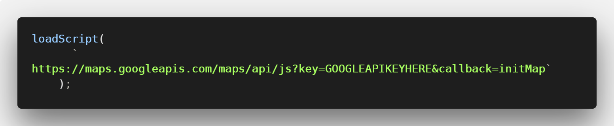

# Neighborhood Map Project
This is the final project (#7) in Udacity's FEND Nanodegree.  Below you will find instructions on getting this app to run on your machine.

## Description
This is an interactive map displaying parks around the city of San Antonio.  The markers drop in upon page load and bounce when clicked or when the corresponding venue is clicked in the venue list.  The venue list may be hidden/shown at anytime simply by clicking the "Menu" button.

Here is a [live demo](#) of the application (not working yet).

## Getting Started
If you want to get your own copy of the neighborhood map just follow these simple steps.

### Get Your API Keys
* You'll need to get your own API key for the Google Maps service and it can be found [here](https://developers.google.com/maps/documentation/javascript/get-api-key)

* Once you've done that you'll want to head over to [Foursquare](https://developer.foursquare.com/), register for an account, and then create your own API keys.  You'll need a `client key` and a `secret key`.

* Save these keys for the steps below.

### Get the Files
Either fork this repo or download the files to your local machine.  Once that's done, cd into the directory and in your command line run `npm install` to get all the packages you'll need listed in the `package.json` file.

Once that rather lengthy install is finished, run `npm start` to get up and running.  Typically this will open your default browser on `port 3000`.  If that doesn't happen and you don't receive any errors in your terminal, open your browser and type `localhost:3000` in the address bar.

Your map and locations will not appear because you have not put your API keys into the right place.

## Put Your API Keys In
In the `App.js` file on line 31 there is a place labeled `GOOGLE API KEY HERE` - that will get your map loaded.  

In the same file on lines 276 and 277 you'll see where your Foursquare `secrect API key` and `client API key` need to be placed.  This will get your venues to load.

### Change Search Parameters
In `App.js` on lines 278, 279, 280 you'll find the search parameters.  Here you can change the `query` to something of your choosing (ex. entertainment).  The `section` can be left blank but can also be changed to something like `food` or `drinks`.  And lastly the `near` parameter can be changed to your city/location to fetch results near that location.

For a full list of parameter possibilities visit the Foursquare [Documentation](https://developer.foursquare.com/docs).

## Required Packages 
No external packages (other than the ones you originally got with these files) are required to run this application.

## Tools Used
* [React](https://reactjs.org/)
* [Create React App](https://github.com/facebook/create-react-app)
* [Google Maps API](https://developers.google.com/maps/documentation/javascript/get-api-key)
* [Foursquare API](https://developer.foursquare.com/)
* [Axios](https://github.com/axios/axios)

## Working Offline
This version of the app will run with a network connection only.  The service worker provided will work once you run `npm run build` in the directory.  Once this process finishes you will have a build version.
